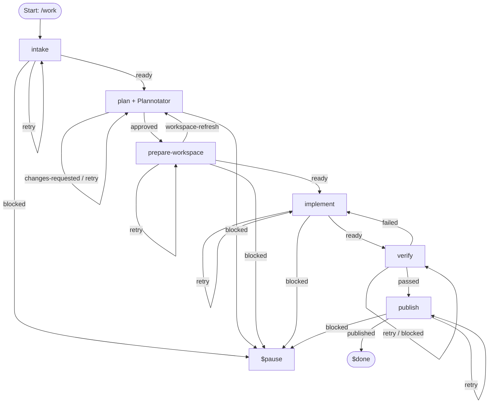
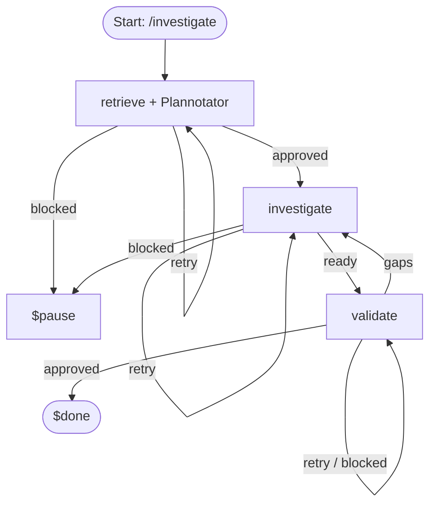
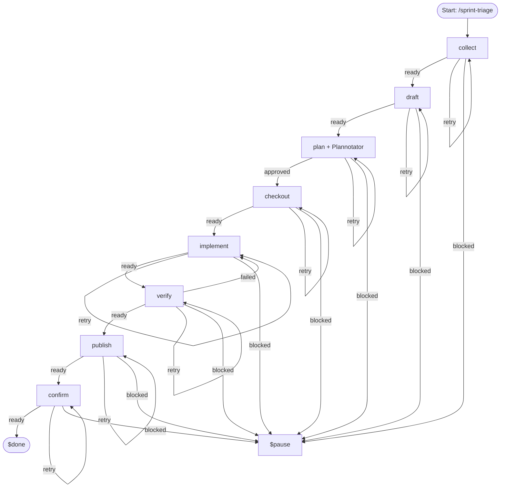

# Workflow Specifications

This directory defines autonomous workflow specifications in `agent/workflows/` composed from stage prompts in `agent/workflows/steps/`.

---

## Review title format

All PR/MR titles created by these workflows follow the [Conventional Commits](https://www.conventionalcommits.org/) grammar:

```
type(scope)!?: brief description
```

- `type` must be one of: `feat`, `fix`, `perf`, `refactor`, `docs`, `test`, `build`, `ci`, `chore`.
- `scope` is optional.
- `!` for breaking changes is optional.
- The subject after the colon must be a brief, imperative description of the change.

Workflow-specific rules:

- **`/work`** — accepts either a free-form requirement or one Jira key. Free-form work uses a semantic descriptive title with no ticket key. Jira-backed work verifies the key during intake and repeats it verbatim in brackets: `fix(scope): [PROJ-1234] resolve missing header`. The bracketed key must exactly match the approved `jiraTicket` value.
- **`/sprint-triage`** — aggregates many support tickets with no single canonical representative. Use a semantic descriptive title only; do not select a representative ticket or append a `[KEY]`. Example: `docs(triage): publish 2026-08-10 to 2026-08-21 support findings`.

Malformed titles or mismatched Jira evidence block publication before any remote mutation.

---

## 1. `/work` — Requirement or Jira Work
Normalizes a free-form requirement or verifies one Jira key, then drafts a Plannotator plan **before** creating the approved deterministic worktree branch. It implements with TDD, independently verifies, and publishes one PR/MR. Existing PR/MR titles remain unchanged; repeated publication changes only workflow-owned description markers.



The plan gate requires: Goal/Acceptance Criteria, Non Goal, Implementation Steps and Tests, Validation, Risks/Decisions Needed, Publications Contract/Metadata, and Execution appendix (machine-readable). Branches are `type/JIRA-123` for verified Jira work or `type/semantic-summary` otherwise; no random suffixes are allowed.

---

## 2. `/jira` — Epic & Story Creation
Normalizes input, verifies Jira issue types and field metadata, approves an Epic/Story creation plan in Plannotator, and creates the hierarchy.


---

## 3. `/investigate` — Evidence & Findings
Retrieves scope/Jira context, gates scope through Plannotator, investigates facts/root causes, and validates findings before writing report.



---

## 4. `/mr-review` — Hosted Code Review
Fetches MR/PR context and discussions, drafts an evidence-based review with proposed inline comments for Plannotator review, publishes comments, and verifies published state.


---

## 5. `/mr-comment` — Review Comment Fixes
Fetches unresolved review discussions, checks out the branch, plans code fixes and discussion replies for Plannotator approval, implements fixes, verifies, and publishes commits + replies.


---

## 6. `/sprint-triage` — Support Ticket Triage & Knowledge Base
Collects OpsBot/Slack ticket threads and drafts redacted records in step handoffs, stores complete ledger and draft content in the Plannotator plan artifact, then checks out & binds KB repo only after approval to write report + ledger + index, verify, and publish to GitLab & Confluence.



