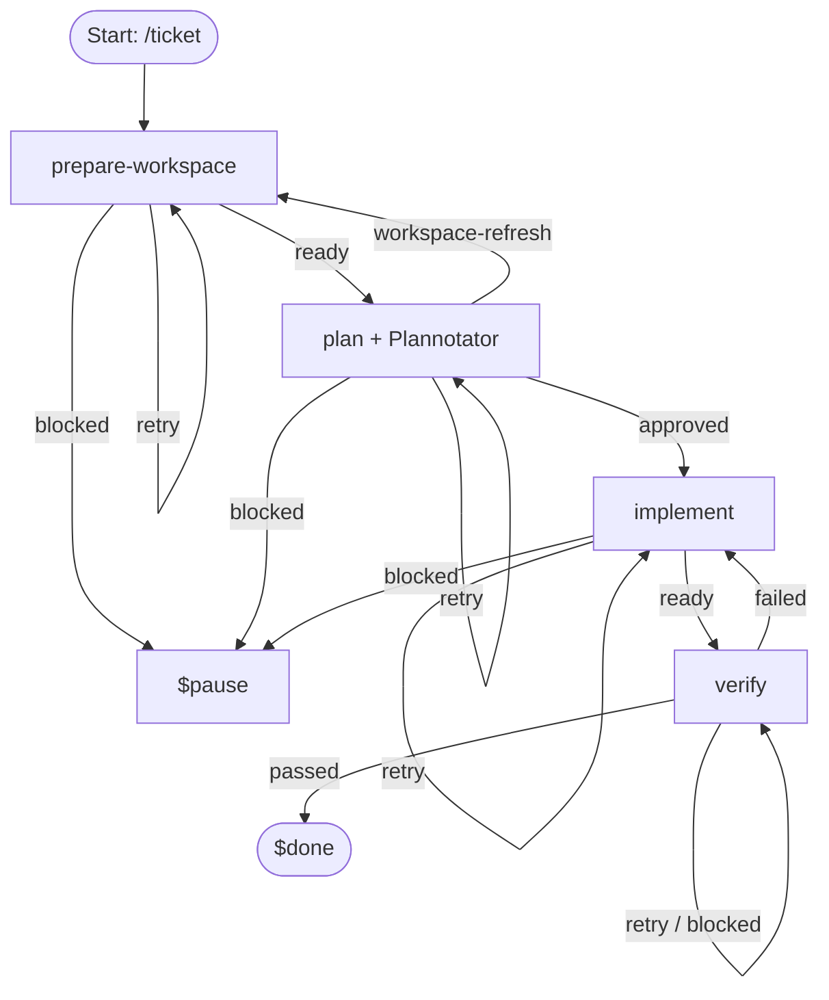
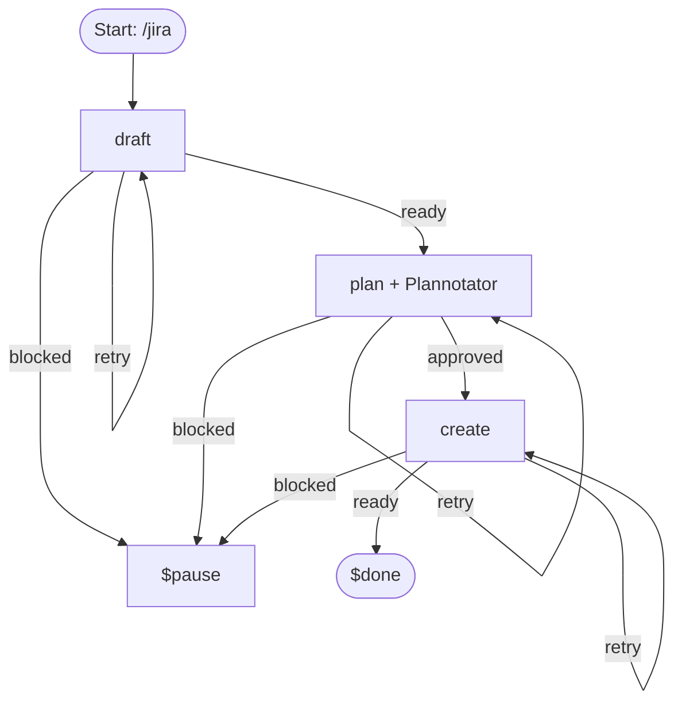
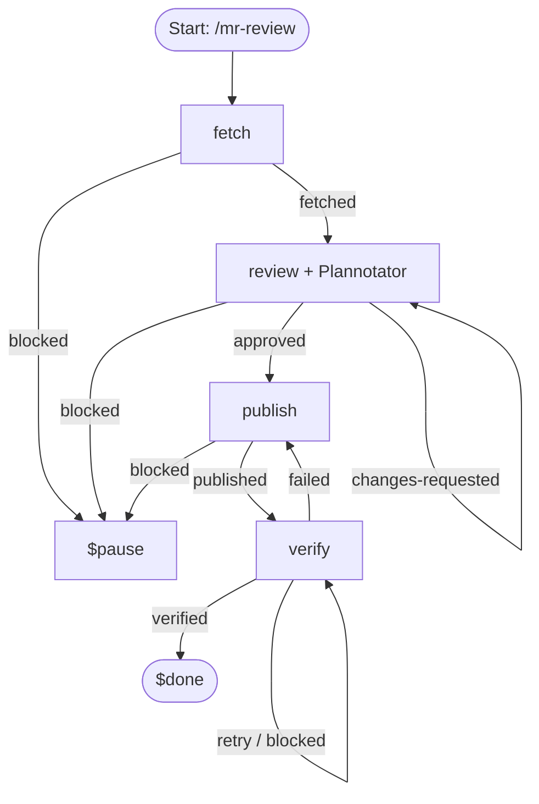
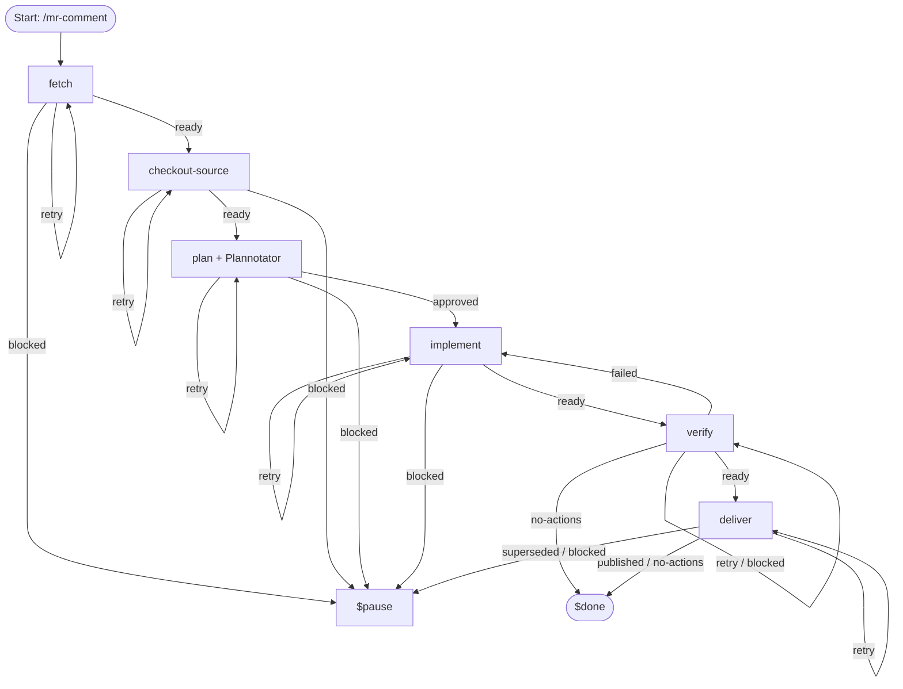

# Workflow Specifications

This directory defines autonomous workflow specifications in `agent/workflows/` composed from stage prompts in `agent/workflows/steps/`.

---

## 1. `/work` — Local Work
Prepares a dedicated workspace, drafts a plan for Plannotator review, implements changes with TDD, and independently verifies.

---

## 2. `/ticket` — Jira Ticket Work
Prepares an isolated worktree, reads Jira acceptance criteria, drafts a plan for Plannotator review, implements with TDD, and independently verifies.

---

## 3. `/jira` — Epic & Story Creation
Normalizes input, verifies Jira issue types and field metadata, approves an Epic/Story creation plan in Plannotator, and creates the hierarchy.

---

## 4. `/investigate` — Evidence & Findings
Retrieves scope/Jira context, gates scope through Plannotator, investigates facts/root causes, and validates findings before writing report.

---

## 5. `/mr-review` — Hosted Code Review
Fetches MR/PR context and discussions, drafts an evidence-based review with proposed inline comments for Plannotator review, publishes comments, and verifies published state.

---

## 6. `/mr-comment` — Review Comment Fixes
Fetches unresolved review discussions, checks out the branch, plans code fixes and discussion replies for Plannotator approval, implements fixes, verifies, and publishes commits + replies.

---

## 7. `/sprint-triage` — Support Ticket Triage & Knowledge Base
Collects OpsBot/Slack ticket threads in generic workspace, drafts redacted records and Confluence action trees, approves publication plan via Plannotator, checks out & binds KB repo, writes report + ledger + index, verifies, and publishes to GitLab & Confluence.

