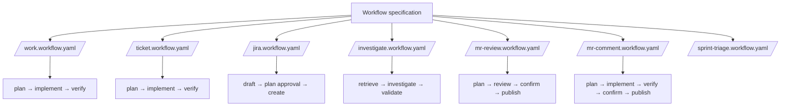
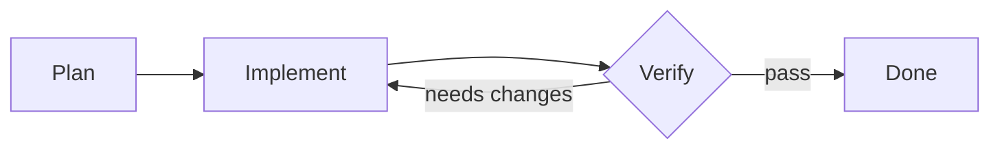

# Local workflow specification

This directory defines the local workflow specification in `agent/workflows/`.
The YAML specifications compose stage prompts in `agent/workflows/steps/`.



`/jira` accepts one readable Markdown-file path or a quick Story breakdown. Its
`draft` stage creates no Jira records. Its Plannotator-gated `plan` stage
validates project metadata, required fields, and dependency links through
Atlassian MCP. Approval authorizes only `create` to make the reviewed Epic and
Stories and re-read them for verification.

## Sprint triage

`/sprint-triage` turns one support profile's inclusive sprint window into
redacted triage guidance and a deterministic decision tree. Invoke it as:

```text
/sprint-triage <support-profile> <start-date> <end-date>
```

Dates must be real `YYYY-MM-DD` values; both endpoints are included in the IANA
time zone configured below. For example,
`/sprint-triage activities_marketing_triage 2026-08-10 2026-08-21` covers all
of 10 through 21 August in that zone.

One-time setup is local only. Copy
`.pi/agent/sprint-triage.example.yaml` to `.pi/agent/sprint-triage.yaml`, then
replace every placeholder. The concrete file is ignored. Configure a resolved
Grafana dashboard UID and unique panel title, not a Grafana `/goto` token, plus
the panel timezone, KB clone URL/project/target branch/checkout root, and
Confluence cloud/page targets. The checkout root must be under
`~/repositories/worktrees`.

The workflow validates inputs and targets, clones the KB locally, reads the
configured panel, recursively narrows capped query ranges, and attempts every
unique Slack ticket thread. Unreadable threads, saturated ranges, or incomplete
pagination stay in its coverage ledger and block publication. It then drafts
source-backed, redacted LLM guidance and a human/LLM decision tree. Plannotator
approves the exact KB files, local branch, MR details, Confluence append body,
and stable marker before any KB write or remote action.

After independent local verification, publication is limited to a non-force
push of the approved branch, one GitLab MR create/read, and one marked
Confluence append/read. It excludes dashboard, Slack, and ticket writes;
merges, approvals, deletions, and force-pushes; and any unapproved remote
mutation. A partial or ambiguous remote effect blocks rather than retrying it.


