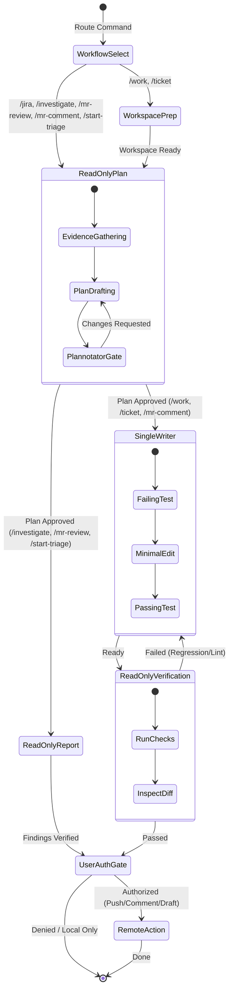

# Pi Coding Contract

Core execution protocol for Pi autonomous workflows and subagents.

## Workflow Lifecycle

## Mandatory Contract Rules

1. **Single Workflow**: Run exactly one workflow (`/work`, `/ticket`, `/jira`, `/investigate`, `/mr-review`, `/mr-comment`, `/start-triage`).
2. **Evidence Taxonomy**:
   - `FACT source`: Proven by explicit line/tool evidence.
   - `HYPOTHESIS confidence + falsifier`: Unproven assumption.
   - `UNKNOWN next check`: Gap to verify.
3. **Workspace Isolation**: Bound dedicated branch/worktree for mutating workflows. Never dirty or reset unrelated checkouts.
4. **Planning Is Read-Only**: Submit scoped plan to Plannotator. Never edit code before approval.
5. **Single Writer**: One implementation child per workspace using TDD (red -> green).
6. **Independent Verification**: Separate read-only reviewer executing full verification suite.
7. **Explicit User Authorization**: External pushes, merges, Jira mutations, or comments require user confirmation.
8. **Secrets & Versions**: Consult Context7 for versioned APIs. Never log secrets.
