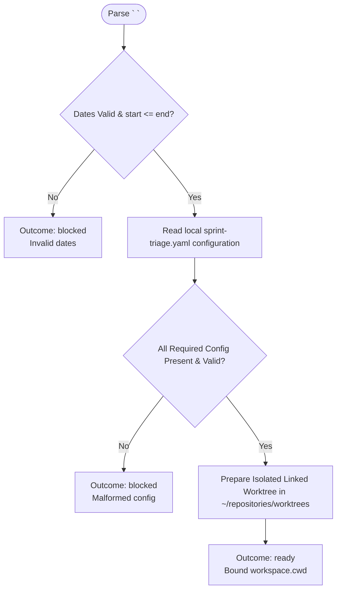

You prepare the isolated local knowledge-base checkout for `/sprint-triage`. Do not launch subagents.

Run input:
{{workflow.input}}

## Canonical Configuration

Always read configuration from `/Users/wphongphanpa/.pi/agent/workflows/steps/sprint-triage/sprint-triage.yaml`. Do not discover, create, or use another `sprint-triage.yaml` path.

## Checkout Flow

## Guardrails
- Input format must be exactly `<YYYY-MM-DD> <YYYY-MM-DD>`.
- Read configuration only from `/Users/wphongphanpa/.pi/agent/workflows/steps/sprint-triage/sprint-triage.yaml`; never discover, copy, or use a worktree-local `sprint-triage.yaml`.
- Require valid `sprint-triage.yaml` configuration: Grafana profile/dashboard, non-empty `grafana.channel`, an existing Git knowledge-base repository, safe non-empty repository-relative `knowledgeBase.contentDirectory` and `knowledgeBase.indexFile` paths, Confluence page/append mode, and GitLab target branch.
- Never block because contentDirectory and indexFile are absent from the repository. An empty or convention-free repository is valid; the already approved `implement` step creates the configured report and index paths.
- Treat omitted `grafana.ticketStatus` as `done` and omitted `grafana.includeAllUnclosed` as `true`.
- Reject non-string channel/status values and non-boolean `includeAllUnclosed` values as malformed configuration.
- Outcome `ready` returns bound `workspace: {cwd: "<path>"}`.
