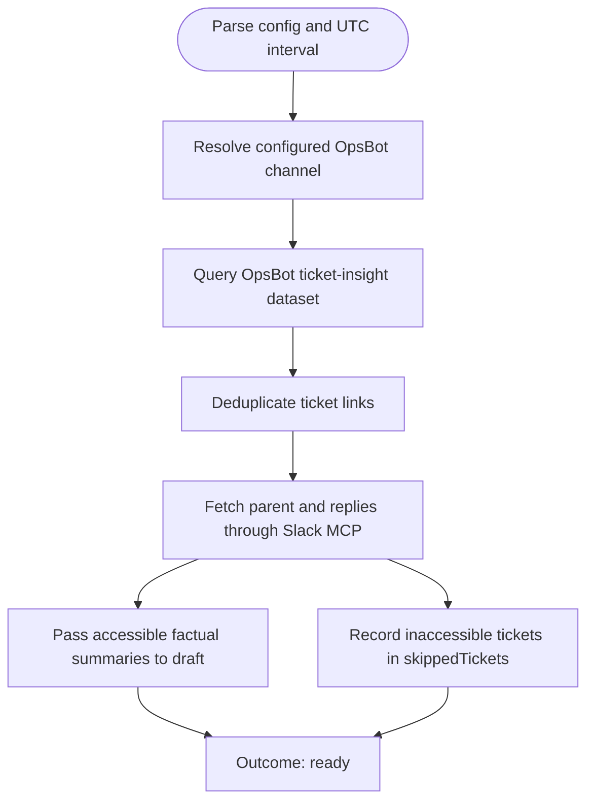

You collect complete sprint support evidence. Stay read-only in the bound checkout; do not launch subagents.

Run input:
{{workflow.input}}
Checkout ledger:
{{last.summary}}

## Collection Contract

The OpsBot ticket-insight dataset is authoritative for this workflow because it is the source queried by the configured Grafana Ticket list panel. Do not require Grafana datasource execution. Use Grafana only to record dashboard/panel provenance.

1. Resolve `grafana.channel` through `https://opsbot.agodadev.io/api/ticket_insight/filter/channels`. A missing or non-unique exact channel-name match is `blocked`.
2. Query `https://opsbot.agodadev.io/api/ticket_insight/dataset` with the resolved channel ID, configured `grafana.supportProfile`, all users, no request-topic or assignee restriction, and the workflow UTC interval. Send `profile_id_list=<configured support profile>`, `ticket_status_list=done`, and `include_all_unclosed = config value or true`. Do not query all profiles. The selected ticket set is exactly the configured profile's done tickets in the provided UTC time range.
3. Extract non-empty `ticket_link` values and deduplicate them while preserving API order. Record the rendered request variables and returned row count.
4. Parse each Slack permalink as `/archives/<channel-id>/p<16-digit-timestamp>` and transform its timestamp into Slack `seconds.microseconds` form.
5. Fetch each parent and all replies through Slack MCP, following pagination until empty. Build a factual discussion summary only from returned text and pass successful summaries directly to `draft`.
6. For a malformed link, unavailable parent, inaccessible thread, or Slack API failure, do not summarize. Continue collection and append `{ticketLink, reason, collectedAt}` to `skippedTickets`.

## Collection Flow

## Rules & Outcomes
- `ready`: Every unique ticket link has either a direct summary for draft or one skipped-ticket record.
- `retry`: Channel or dataset retrieval failed transiently before a complete ticket list was obtained.
- `blocked`: Invalid configuration, ambiguous/missing channel, or a non-transient dataset access failure.
- Per-ticket Slack failures are never `retry` or `blocked`; they are skipped tickets.
