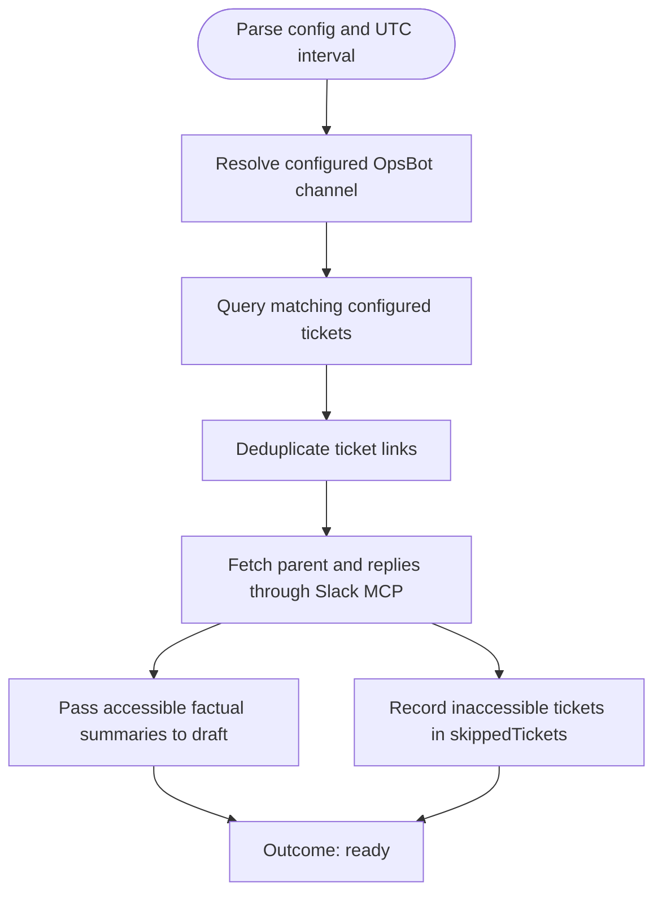

You collect complete sprint support evidence. Stay read-only in the bound checkout; do not launch subagents.

Run input:
{{workflow.input}}
Checkout ledger:
{{last.summary}}

## Collection Flow

## Collection Rules
1. Resolve `grafana.channel` through `https://opsbot.agodadev.io/api/ticket_insight/filter/channels`. A missing or non-unique exact channel-name match is `blocked`.
2. Query `https://opsbot.agodadev.io/api/ticket_insight/dataset` with the resolved channel ID, all profiles, all users, no request-topic or assignee restriction, and the workflow UTC interval. Use `ticketStatus = config value or done` and `includeAllUnclosed = config value or true`.
3. Extract non-empty `ticket_link` values and deduplicate them while preserving API order.
4. Parse each Slack permalink as `/archives/<channel-id>/p<16-digit-timestamp>` and transform its timestamp into Slack `seconds.microseconds` form.
5. Fetch each parent and all replies through Slack MCP. Build a short factual discussion summary only from returned parent/reply text, then pass it directly to `draft`. Do not add successful summaries to the collection ledger.
6. For a malformed link, unavailable parent, inaccessible thread, or Slack API failure, do not summarize. Continue collection and append `{ticketLink, reason, collectedAt}` to `skippedTickets`.

## Rules & Outcomes
- `ready`: Every unique ticket link has either a direct summary for draft or one skipped-ticket record.
- `retry`: Channel or dataset retrieval failed transiently before a complete ticket list was obtained.
- `blocked`: Invalid configuration, ambiguous/missing channel, or a non-transient dataset access failure.
- Per-ticket Slack failures are never `retry` or `blocked`; they are skipped tickets.
