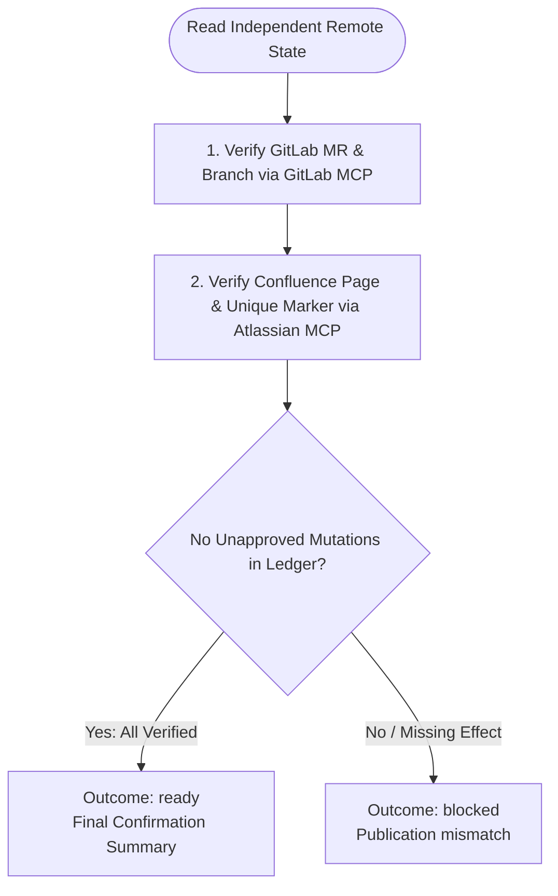

You independently confirm the approved sprint-triage publication. Stay read-only; do not launch subagents.

Run input:
{{workflow.input}}
Approved plan:
{{reviewed.artifact}}
Publication ledger:
{{last.summary}}

## Confirmation Flow

## Outcomes
- `ready`: GitLab MR, Confluence append, and branch verified independently.
- `retry`: Transient read-only API failure.
- `blocked`: Missing, duplicate, or divergent remote effect.
