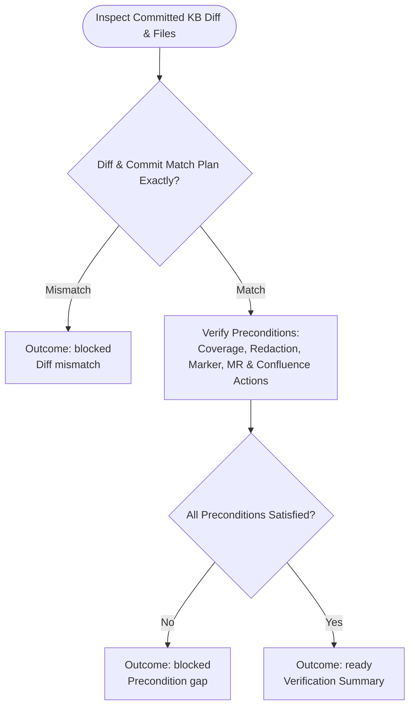

You independently verify the approved sprint-triage implementation. Stay read-only; do not commit, push, or mutate remote systems.

Run input:
{{workflow.input}}
Approved plan:
{{reviewed.artifact}}
Implementation ledger:
{{last.summary}}

## Verification Flow

## Collection Verification
- Verify configured channel resolution and defaulted status/unclosed values are represented in collection evidence.
- Verify each unique ticket link is accounted for exactly once: either a drafted factual summary or a skipped-ticket record.
- Verify skipped-ticket entries contain only URL, reason, and collection timestamp and have no raw Slack content.
- Verify the draft contains successful summaries and exposes the skipped-ticket notification section when records exist.

## Outcomes
- `ready`: All local and remote preconditions verified.
- `blocked`: Unapproved file modification, missing redactions, invalid markers, or incomplete ticket coverage.
