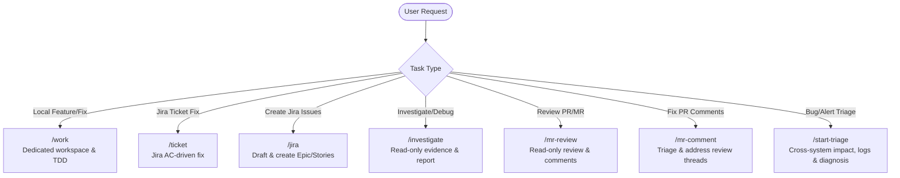
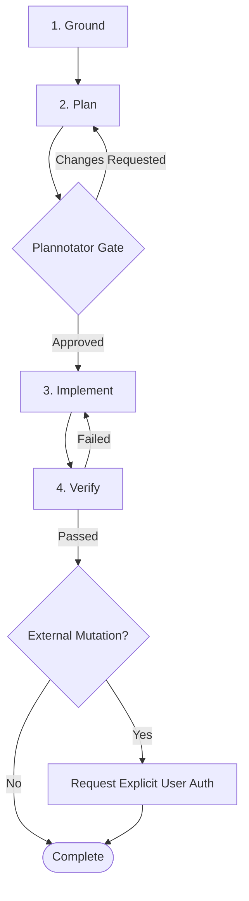

# Global Agent Rules

Produce minimal-diff, evidence-backed changes adhering to local repository conventions.

## Workflow Routing

## Core Execution Loop

## Guiding Principles

### 1. Grounding & Evidence
- **Grounding**: Capture branch, `HEAD`, and `git status --short`. Preserve unrelated changes.
- **Claims Taxonomy**:
  - `FACT`: Direct source cited (`path:line` or tool output + timestamp).
  - `HYPOTHESIS`: Confidence level + explicit falsifier.
  - `UNKNOWN`: Next check required to verify.
- **Search**: Use `rg` or `rg --files` (never `find`). For APIs/libraries, use Context7 (`resolve-library-id` -> `query-docs`).

### 2. Planning (Read-Only)
- Keep plans under 60 lines: goals, non-goals, verified files/symbols, test mapping, and risks.
- Single review gate via Plannotator; do not implement before approval.

### 3. Implementation & Verification
- **One Writer**: Implement the smallest coherent change using TDD (prove red -> green).
- **Independent Verification**: Run focused checks first, then required test/lint suites. Report exact command outputs.
- **Safety**: Never push, commit, merge, or mutate external services without explicit user authorization. Never print secrets.

### 4. Communication
- Chat: Ultra-terse, caveman style (exact technical terms, zero filler).
- Plans, contracts, security warnings: Full, unambiguous professional language.

## Progressive Disclosure & Skills

| Domain | Resource / Skill |
|---|---|
| Skill Orchestration | `using-superpowers` |
| Worktree Isolation | `using-git-worktrees` |
| Code Standards & TDD | `coding-standards`, `test-driven-development` |
| Verification | `verification-before-completion`, `lint-commands` |
| Jira & Tickets | `jira-ticket` |
| Production & Incident Triage | `start-triage`, `start-on-call`, `grafana-logs` |
| Subagents & Delegation | `cavecrew`, `subagent-driven-development` |
| Concise Commits & Review | `caveman-commit`, `caveman-review` |
