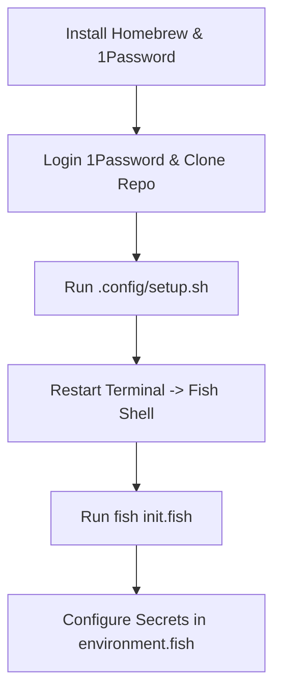

# Dotfiles & Workstation Setup

Personal environment bootstrap and configuration.

## Setup Flow



## Quick Start

```bash
# 1. Prerequisites
/bin/bash -c "$(curl -fsSL https://raw.githubusercontent.com/Homebrew/install/HEAD/install.sh)"
brew install --cask 1password

# 2. Setup
cd .config
bash setup.sh

# 3. Initialize Fish
fish init.fish
```

### Environment Secrets
Add custom environment variables to `~/.config/fish/conf.d/environment.fish`:
```fish
set -gx SECRET_NAME ${SECRET}
```

## System Shortcuts

| Shortcut | Action |
|---|---|
| `Cmd + \`` | Change input language |
| `Cmd + Space` | Raycast launcher |
| Hot corner (bottom right) | Show desktop |

## Vimium Keymaps

```vim
unmap J
unmap K
map J nextTab
map K previousTab
unmap <c-e>
unmap <c-y>
unmap d
unmap u
map <c-d> scrollPageDown
map <c-u> scrollPageUp
unmap x
map d removeTab
unmap gt
unmap gT
unmap b
unmap B
```
